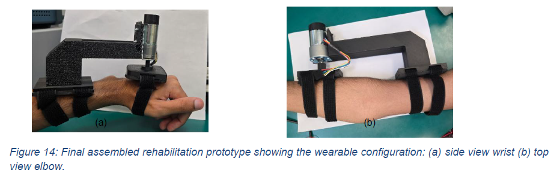
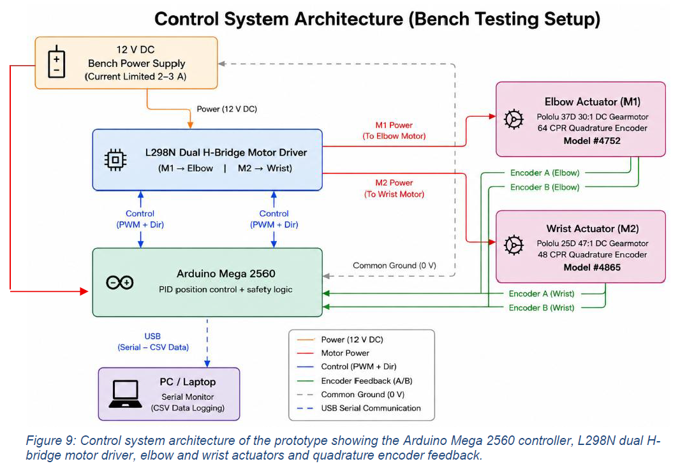
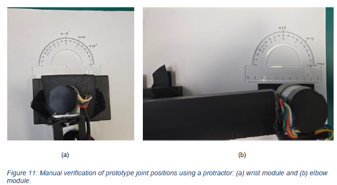
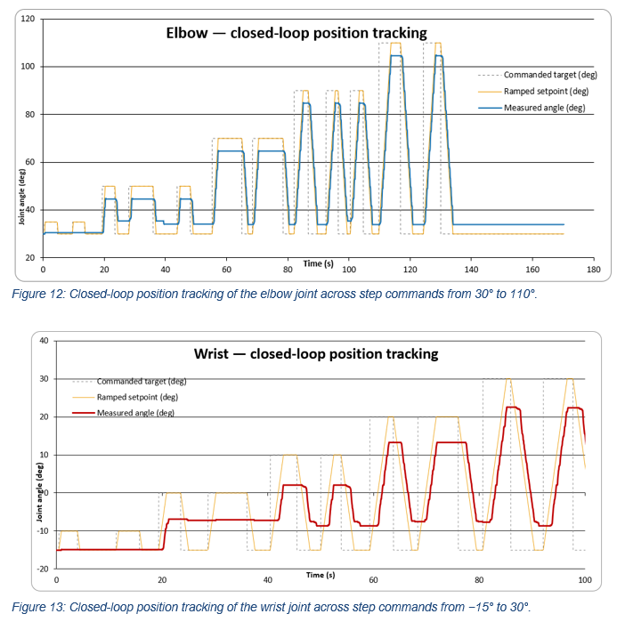

# Modular Elbow–Wrist Rehabilitation Exoskeleton

MSc Mechatronics & Robotics Engineering project, University of Leeds.

Design, manufacture and experimental validation of a modular upper-limb
rehabilitation prototype delivering controlled elbow flexion–extension and
wrist radial–ulnar deviation for gravity-supported tabletop therapy.

---

## Overview

Two independently mounted, independently manufacturable modules:

| | Elbow | Wrist |
|---|---|---|
| Motion | Flexion–extension | Radial–ulnar deviation |
| Operational ROM | 30° to 120° | −15° to +35° |
| Actuator | Pololu 37D, 30:1, 12 V | Pololu 25D, 46.85:1, 12 V |
| Encoder | 64 CPR quadrature | 48 CPR quadrature |
| Resolution | 0.1875°/count at output | 0.160°/count at output |

Structure is FDM-printed PLA. Control is an Arduino Mega 2560 driving an
L298N dual H-bridge from a 12 V bench supply. The prototype was validated
under unloaded bench-top conditions.

---

## Engineering work

- Mechanical concept generation and weighted concept selection
- CAD design of modular elbow and wrist assemblies
- Anthropometric sizing (5th percentile female to 95th percentile male)
- Actuator torque and speed calculation, and motor selection
- Arduino firmware development in C++
- Closed-loop PD position control with encoder feedback
- Multi-layer software safety logic
- Prototype manufacture, assembly and commissioning
- Experimental validation and data analysis

---

## System architecture

The firmware implements:

- PD closed-loop position control
- velocity-limited setpoint ramping
- software range-of-motion protection with latched fault state
- motion timeout detection for stall and obstruction
- direction verification against commanded motor polarity
- software emergency stop requiring manual reset
- CSV serial data logging at approximately 50 ms intervals

---

## Experimental results

Encoder-reported angles were verified against physical joint positions
measured with a manual protractor before closed-loop testing began.

| Measurement | Elbow | Wrist |
|---|---|---|
| Max encoder calibration error | 4° | 4° |
| Max closed-loop steady-state error | 5.8° | 7.9° |

Residual error is attributed to gearbox friction and the voltage drop of
the temporary L298N driver, which left insufficient torque authority near
the setpoint. Raw logs and tracking plots are in `results/`.

---

## Limitations

This is a proof-of-concept prototype and was not clinically tested.

- Validation was unloaded and bench-based, with no human participants.
- The mechanical hard stop was designed in CAD but not manufactured, so
  only the software safety layer was experimentally verified.
- Each module was validated individually; the combined two-joint task
  sequence was not demonstrated.

---

## Repository structure

| Folder | Contents |
|---|---|
| `firmware/` | Arduino control firmware |
| `cad/` | STEP assemblies and technical drawings |
| `results/` | Experimental CSV data and tracking plots |
| `images/` | Prototype photographs and system diagrams |
| `docs/` | Two-page project summary |

---

## Author

**Muhammad Ayan Tariq**
MSc Mechatronics & Robotics Engineering, University of Leeds