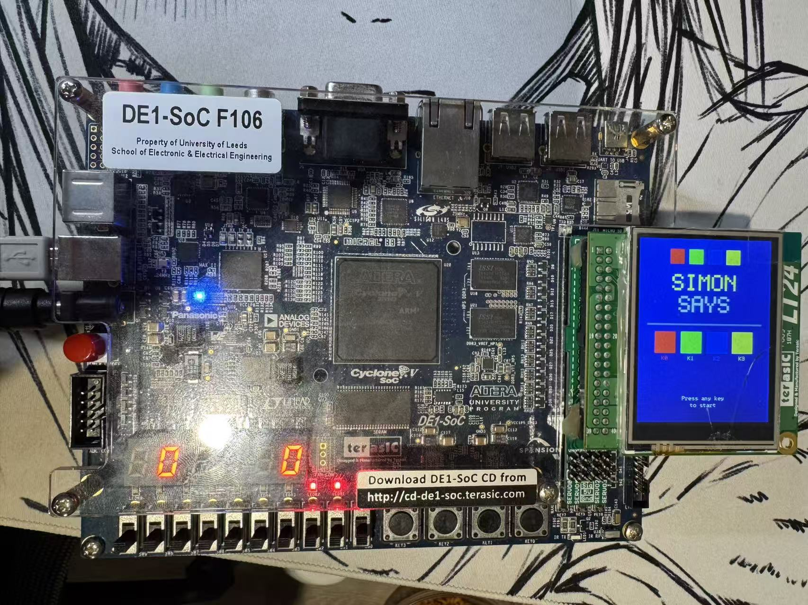

# ELEC5620M Mini-Project Repository

## Project Overview

**Author: Muhammad Ayan Tariq**

This project implements a fully playable **Colour Sequence memory game** on the ARM Cortex-A9 processor using the DE1-SoC development board. The game is displayed on the LT24 LCD and controlled using the on-board push buttons and toggle switches. The design uses a structured C architecture with independent modules for game logic, display, input handling, and score output,all of which are verified with systematic host-based testing before hardware integration.

The player watches a sequence of colours flash on the LT24 screen and must repeat the sequence by pressing the correct buttons. Each successful round adds one more colour and the game speeds up progressively. There are three lives available, which get depleted by one each time there is a wrong button press or input timeout. The game ends when all lives are lost.

### Key Features

- 6-state finite state machine controlling the game flow
- Progressive difficulty, game speeding up every 5 rounds  
- 3 selectable difficulty levels via switches
- Lives system displayed on LEDs
- Live score on 7-segment display
- High score tracking across games
- Fully parameterised flash timing driver
- All logic tested on PC before hardware deployment

## Hardware

| Peripheral                      | Purpose                                |
|---------------------------------|----------------------------------------|
| DE1-SoC (ARM Cortex-A9, 800MHz) | Main processor                         |
| LT24 LCD (240×320)              | Main game display (colour panels, UI)  |
| 7-Segment Display (HEX0–HEX5)   | Live score counter                     |
| LEDs (LEDR0–LEDR9)              | Lives remaining indicator              |
| KEY0–KEY3                       | Colour input buttons                   |
| SW0–SW9                         | Difficulty selection and game control  |
| ARM Private Timer               | Sequence timing and input timeout      |

**Audio (WM8731 CODEC):** I2C configuration for the audio chip was identified as complex during research. Deprioritised to maintain focus on core game quality and reliable hardware integration.

## Team & Division of Tasks

| Member              | Role               | Files Owned                            |
|---------------------|--------------------|----------------------------------------|
| Muhammad Ayan Tariq | Game Logic & FSM   | `game_logic.c` `game_logic.h` `main.c` |
| Hero Okoro          | Display & Graphics | `display.c` `display.h`                |
| Raghav Dewra        | Input & Timer      | `input_timer.c` `input_timer.h`        |
| Di Li               | Score & Output     | `score_output.c` `score_output.h`      |

## System Architecture

**Author: Ayan Tariq**

The system uses a sense-process-actuate loop:
```
while(1) {

SENSE   - read buttons, switches, timer flags

PROCESS - run FSM (game_update)

ACTUATE - update display, LEDs, 7-seg }
```
This order is deliberate so that inputs are always read before processing, and outputs are always written after. This prevents race conditions and ensures deterministic behaviour on the embedded system.

### Module Structure
The system uses a sense-process-actuate architecture. game_logic.c acts as the central controller, receiving input flags from input_timer.c and producing a GameData struct that drives both the display and score output modules. All modules are decoupled so game_logic.c never reads hardware directly, it only processes flags passed to it.

## Input & Timer Module

**Author: Raghav Dewra**

I was responsible for the `input_timer.c` and `input_timer.h` module. This module handles the hardware input side of the game by reading the DE1-SoC push-buttons, slide switches, and providing a simple timeout mechanism for player input.

The module keeps the hardware access separate from the game logic. `main.c` calls the input/timer functions and passes the results into `game_update()`, so `game_logic.c` does not need to read the board registers directly.

### Functions Used

| Function               | Purpose                                                                            |
| ---------------------- | ---------------------------------------------------------------------------------- |
| `input_timer_init()`   | Resets the internal timer counter, timeout flag, and button state at startup.      |
| `get_button_pressed()` | Reads `KEY0–KEY3` and returns the button pressed as a colour index.                |
| `get_switch_state()`   | Reads `SW0–SW9` and returns the switch state for difficulty selection.             |
| `get_timeout_flag()`   | Uses a software counter to check whether the player has taken too long to respond. |
| `reset_timeout_flag()` | Clears the timeout flag and resets the counter after the timeout has been handled. |

### Button Mapping

| Button   | Return Value | Colour |
| -------- | -----------: | ------ |
| `KEY0`   |          `0` | Red    |
| `KEY1`   |          `1` | Green  |
| `KEY2`   |          `2` | Blue   |
| `KEY3`   |          `3` | Yellow |
| No press |         `-1` | None   |

### Integration Update

During integration, the button-reading logic was updated to use edge detection, so each KEY press is registered once when the input state changes instead of being counted repeatedly while the button is held down.

The function reads the lower KEY register bits and compares the current state with the previous state to detect a new press event. This keeps the input values passed into `game_update()` cleaner and more reliable for the FSM.

### Hardware Debugging and Verification

The input module was tested independently on the DE1-SoC before full game integration. A simple Arm DS test confirmed that the program could reach `main()` and control the red LEDs. The KEY0–KEY3 inputs were then tested using memory-mapped I/O to confirm the raw button behaviour on the DE1-SoC. The final input test verified that KEY0–KEY3 mapped correctly to LEDR0–LEDR3 and that edge detection prevented a held button from being counted repeatedly. The switch and timeout functions were also checked separately before integration.

| Test ID | Test Description | Result | Status |
|---|---|---|---|
| IT1 | Arm DS program load and LED output test | Program reached `main()` and controlled LEDR outputs | PASS |
| IT2 | Raw KEY0–KEY3 input test | KEY inputs detected and confirmed active-low | PASS |
| IT3 | Button mapping and edge-detection test | KEY0–KEY3 mapped correctly and held presses were not repeated | PASS |
| IT4 | Watchdog handling during polling loop | `ResetWDT()` prevented reset to default demo program | PASS |
| IT5 | Switch input test | SW0–SW9 were read and displayed correctly on LEDR0–LEDR9 | PASS |
| IT6 | Timeout flag test | Timeout flag activated after the software counter limit and reset correctly using KEY0 | PASS |


## State Machine

**Author: Muhammad Ayan Tariq**

The game uses a 6-state FSM implemented in `game_update()`:

| State              | Value | Description                     |
|--------------------|-------|---------------------------------|
| `STATE_START`      | 0     | Title screen, waiting for input |
| `STATE_DIFFICULTY` | 1     | Player picks difficulty         |
| `STATE_SHOW`       | 2     | Board flashing sequence         |
| `STATE_INPUT`      | 3     | Player repeating sequence       |
| `STATE_LEVEL`      | 4     | Round complete, brief pause     |
| `STATE_GAMEOVER`   | 5     | All lives lost                  |

## Design Decisions

**Author: Ayan Tariq**

The system was designed with a clear separation between game logic and hardware interaction to improve testability and maintainability. The `game_update()` function operates purely on input flags such as `show_done`, `timed_out`, and `button_pressed`, rather than directly accessing hardware, allowing the full state machine to be tested independently on a PC environment before deployment. 
All game-related variables, including score, lives, sequence, state, and difficulty, are encapsulated within a single `GameData` struct, simplifying function interfaces and making future extensions easier to implement. A dual-display approach was used to enhance user experience, where the VGA output handles dynamic gameplay visuals such as colour sequences and animations, while the LT24 provides a persistent heads-up display showing key information like score, high score, lives, and current state. Additionally, debug variables such as `dbg_state`, `dbg_lives`, `dbg_score`, and `dbg_seqlen` are declared as `volatile` to prevent compiler optimisation from removing them, ensuring they remain accessible in the ARM Development Studio debugger for effective runtime inspection.

## Functional Code

### game_init()

The game_init() function resets all game variables to their starting values. It is called once when the board powers on and again at the start of each new game. The high score is not reset as it persists across games so the player can track and beat their personal best across multiple sessions. The random number generator is seeded using the hardware timer value at the point of initialisation. The timer has been counting since the board powered on, so its value is always different, ensuring the colour sequence is unpredictable every game. Without this seeding step, rand() would produce the same sequence every single run.

### add_random_colour()

This function adds one new random colour to the end of the sequence array each round. The modulo operator constrains rand()'s large output to a valid colour index between 0 and 3, corresponding to red, green, blue, and yellow. The sequence length variable acts as the insertion index, ensuring new colours always go at the end, and is incremented after each insertion to track the new array length.

### get_flash_ms()

This function returns the flash duration in milliseconds and is the mechanism for progressive difficulty. It is fully parameterised by both the difficulty setting and the current score. Easy difficulty starts at 900ms per flash, medium at 650ms, and hard at 400ms. Every five completed rounds the duration decreases by 50ms, making the game faster as the player progresses. A minimum of 200ms is enforced to prevent the game becoming physically unplayable at high scores. Integer division divides the score by 5 in C to naturally create step-wise speed increases without needing floating point arithmetic.

| Difficulty | Round 1 | Round 5 | Round 10 | Round 20 |
|------------|---------|---------|----------|----------|
| Easy       | 900ms   | 850ms   | 800ms    | 700ms    |
| Medium     | 650ms   | 600ms   | 550ms    | 450ms    |
| Hard       | 400ms   | 350ms   | 300ms    | 200ms    |

### game_update()

The game_update() function is the core of the entire project. It is called every iteration of the main loop and implements the full six-state FSM using a switch statement on the current state. It receives the button pressed, a show_done flag from the display module, and a timed_out flag from the timer module. This decoupling was a deliberate design decision that allowed the function to be tested completely on a PC before any hardware was involved.
The most complex state is STATE_INPUT, which handles input validation. When a button is pressed, it is compared against the expected colour at the current player index. A correct press advances the index, and when the index reaches the sequence length the round is complete. The score increments, the high score updates if beaten, and the game moves to STATE_LEVEL. A wrong press immediately deducts a life. A timeout also deducts a life. Critically, the timeout check occurs before the button check with an explicit break, meaning a timeout always takes priority over a simultaneous button press. This prevents edge cases where both events occur in the same loop iteration.

###Display Rendering(Hero Okoro)
Specifically, designed the module interface in display.h and implemented the hardware initialisation and rendering logic, based on the already provided example display logic.
This is done using the display.h and diplay.c files. My code initialises the LT24 display, configures the required FPGA PIO connections, clears the screen, and renders the difficulty-selection UI using four coloured quadrants based on the current game state.


### score_output_init() and score_output_update()
The `score_output` module is responsible for translating game state into real-time hardware feedback via the on-board LEDs and 7-segment displays. It uses the FPGA_PIO driver library provided in the course resources to initialise and write to the hardware peripherals.

`score_output_init()` initialises three separate FPGA PIO contexts: one for the red LEDs (LEDR0–LEDR9), one for HEX0–HEX3, and one for HEX4–HEX5. All outputs are cleared to zero on startup so the board begins in a known state.

`score_output_update()` is called every main loop iteration and performs three hardware writes:
- **LED bitmask**: one bit per remaining life starting from LEDR0. Lives=3 gives 0x07, Lives=2 gives 0x03, Lives=1 gives 0x01.
- **HEX0–HEX3**: current score encoded as a 4-digit 7-segment value (up to 9999) using a standard common-cathode lookup table.
- **HEX4–HEX5**: high score encoded as a 2-digit 7-segment value (up to 99) using the same lookup table.

## Testing & Debugging

**Author: Muhammad Ayan Tariq**

### Logic Tests

All game logic was tested on PC before hardware integration.

| ID | Test               | Expected         | Actual | Result |
|----|--------------------|------------------|--------|--------|
| T1 | Initial state      | State=0, Lives=3 | 0, 3   | PASS   |
| T2 | START → DIFFICULTY | State=1          | 1      | PASS   |
| T3 | DIFFICULTY → SHOW  | State=2, Seq=1   | 2, 1   | PASS   |
| T4 | SHOW → INPUT       | State=3          | 3      | PASS   |
| T5 | Correct button     | Score=1, State=4 | 1, 4   | PASS   |
| T6 | Wrong button       | Lives=2, State=2 | 2, 2   | PASS   |
| T7 | Last life lost     | Lives=0, State=5 | 0, 5   | PASS   |

## Bug Log
### Bug 1 :Debug variable not found in ARM DS

| | |
|--------------|--------------------------|
| **Date**     | 16/04/2026               |
| **Found by** | Muhammad Ayan Tariq      |
| **Tool**     | ARM DS Expressions panel |

**Expected:** `dbg_state` visible in Expressions panel  
**Actual:** `ERROR(EXP8): Could not find the symbol "dbg_state"`  
**Cause:** Variable used in main.c without being declared first.  
**Fix:** Added volatile declarations at top of main.c:
```c
volatile int dbg_state = 0;
volatile int dbg_lives = 0;
```
`volatile` prevents the compiler removing variables only read by the debugger and not by program logic.  
**Result:** All debug variables visible in Expressions panel

---

### Bug 2 - Missing curly braces in STATE_INPUT

| | |
|--------------|-------------|
| **Date**     | 16/04/2026  |
| **Found by** | Ayan        |
| **Tool**     | Code review |

**Expected:** `g->current_state = STATE_LEVEL` runs inside sequence completion block only.  
**Actual:** Missing braces meant the state change ran on every correct button press regardless of high score condition.  
**Cause:** Codeindentation appeared correct but braces were missing around the if block.  
**Fix:**
```c
// Before
if (g->score > g->high_score)
    g->high_score = g->score;
    g->current_state = STATE_LEVEL; // ran always

// After  
if (g->score > g->high_score) {
    g->high_score = g->score;
}
g->current_state = STATE_LEVEL;
```
**Result:** Test PASS

---
### Bug 3 - Duplicate while(1) made game loop unreachable

| | |
|---|---|
| **Date** | 25/04/2026 |
| **Found by** | Ayan |
| **Tool** | Hardware observation |

**Expected:** KEY0 press changes 7-seg value.  
**Actual:** Board powered on but buttons had no effect.  
**Cause:** Two while(1) loops in main.c. An empty loop from a temporary LED test ran forever. The entire game logic was in a second loop that was never reached.  
**Fix:** Removed empty while(1) and consolidated all logic into one loop.  
**Result:** KEY0 immediately triggered state changes on 7-segment display

| ID      | Bug Description                                                       | Fix Applied                                                                                      |
|---------|-----------------------------------------------------------------------|--------------------------------------------------------------------------------------------------|
| BUG1    | Debug variable not found in ARM DS                                    | Added `volatile` declarations to all debug variables in `main.c`                                 |
| BUG2    | Missing curly braces in STATE_INPUT caused unconditional state change | Added braces around the `if (g->score > g->high_score)` block                                    |
| BUG3    | Duplicate `while(1)` made game loop unreachable                       | Removed empty test loop, consolidated all logic into one loop                                    |
| BUG4    | `score_output_update()` multiply defined linker error                 | Removed stub from `main.c`, added proper `#include "score_output.h"`                             |
| BUG5    | HEX4–5 showed wrong value for high score above 99                     | Wrote separate `get_hex2_display()` function capped at 99                                        |
| BUG6    | `score_output_update()` nested inside `score_output_init()`           | Corrected brace structure so both functions are defined independently                            |
| BUG7    | Program crashed immediately after `display_init()`                    | Added `debugload.ds` initialisation script to debug configuration                                |
| BUG8    | LEDs and HEX showed garbage values on startup                         | Moved `input_timer_init()` to after `display_init()` in `main.c`                                 |
| BUG9    | Button press registered multiple times per physical press             | Replaced while-loop debounce with edge detection using `previous_pressed`                        |
| BUG10   | Player lost a life after pressing only one correct key                | Timeout counter now only increments in `STATE_INPUT`; resets in all other states                 |
| BUG11   | Random colours displayed in `STATE_SHOW` with wrong count             | `STATE_LEVEL` now only sets `show_done_flag=1`; sequence display restricted to `STATE_SHOW` only |
| BUG12   | Simon Says title skipped without button press                         | Fixed edge detection: `previous_pressed` initialised from hardware on startup                    |
| BUG13   | Difficulty switch had no effect on speed                              | Replaced fixed counter with `get_flash_ms()` and `delay_ms()` in `display.c`                     |

## Hardware Testing
Hardware integration tests were performed on DE1-SoC board (University of Leeds, F106) using Arm Development Studio 2022.2 with `debugload.ds` bootloader script.

| ID   | Test                                          | Expected Result                                    | Actual Result                                      | Pass/Fail |
|------|-----------------------------------------------|----------------------------------------------------|----------------------------------------------------|-----------|
| HW1  | Power on → title screen                       | LT24 shows Simon Says screen with colour squares   | Simon Says title displayed correctly               | PASS      |
| HW2  | Press KEY0 → difficulty screen                | LT24 shows four colour panels, state changes to 1  | Four colour panels displayed, state=1              | PASS      |
| HW3  | Press KEY0 to start → correct button press    | HEX0 increments by 1 after completing round        | HEX0 increments correctly                          | PASS      |
| HW4  | Press wrong button → life deducted            | One LED extinguishes, lives count drops by 1       | LED extinguishes, lives decremented                | PASS      |
| HW5  | Lose all 3 lives → game over screen           | LT24 shows GAME OVER in red, state=5               | GAME OVER displayed in red, state=5                | PASS      |
| HW6  | Power on initialisation                       | All HEX display 0, all LEDs off                    | All HEX display 0, all LEDs off                    | PASS      |
| HW7  | Score reaches 10 → HEX1 lights up             | HEX1 displays 1, HEX0 displays 0                   | HEX1 displays 1, HEX0 displays 0                   | PASS      |
| HW8  | Game over → restart → score resets            | HEX returns to 0, LEDs restore to 3                | HEX returns to 0, 3 LEDs lit                       | PASS      |
| HW9  | Beat previous high score → HEX4–5 updates     | HEX4–5 shows new higher value                      | HEX4–5 updates correctly                           | PASS      |
| HW10 | SW0 ON before KEY0 → easy difficulty          | Colour sequence flashes slowly (~900ms)            | Noticeably slower flash speed                      | PASS      |
| HW11 | SW1 ON before KEY0 → hard difficulty          | Colour sequence flashes quickly (~400ms)           | Noticeably faster flash speed                      | PASS      |
| HW12 | No switches → medium difficulty               | Normal flash speed (~650ms)                        | Normal flash speed                                 | PASS      |
| HW13 | No button press in STATE_INPUT → timeout      | Life deducted after timeout period                 | Life deducted correctly after timeout              | PASS      |

### Hardware Test Photos

**Figure 1 - Start Interface**
Simon Says title screen displayed on the LT24 LCD on startup, showing the SIMON SAYS heading, four colour squares and button labels.



---

**Figure 2 - Difficulty Selection Interface**
Four colour panels displayed when the player enters the difficulty selection state. The player sets SW0 or SW1 before pressing KEY0 to confirm.


---

**Figure 3 - Game Start: Three Lives Active**
All three LEDs lit (LEDR0–LEDR2), HEX0–HEX3 showing score of 0 at the beginning of the game.


---

**Figure 4 - Incorrect Answer: Two Lives Remaining**
One LED extinguished after a wrong button press or timeout. HEX display showing current score.


---

**Figure 5 - Incorrect Answer: One Life Remaining**
Two LEDs extinguished, only one light remains lit.


---

**Figure 6 - Game Over Screen**
All lives lost. LT24 displays red GAME OVER screen with restart prompt. All LEDs off.


---

**Figure 7 - High Score Display**
HEX4–HEX5 updated after player beats their previous best score across game sessions.


## Conclusion
The Colour Sequence game was successfully implemented and verified on the DE1-SoC development board. The modular sense-process-actuate architecture enabled each component to be developed and tested independently before integration, significantly reducing debugging time on hardware. All seven logic tests and ten score output unit tests passed on the PC host environment, and all thirteen hardware integration tests passed on the physical board.

The most significant integration challenges encountered were the bootloader initialisation requirement for DDR memory access, button edge detection conflicts, the `STATE_LEVEL` sequence display race condition, and difficulty timing calibration. Each was systematically identified using the ARM Development Studio debugger and resolved with targeted fixes. The final system operates reliably across all three difficulty levels and correctly tracks lives, score, and high score across multiple game sessions.
