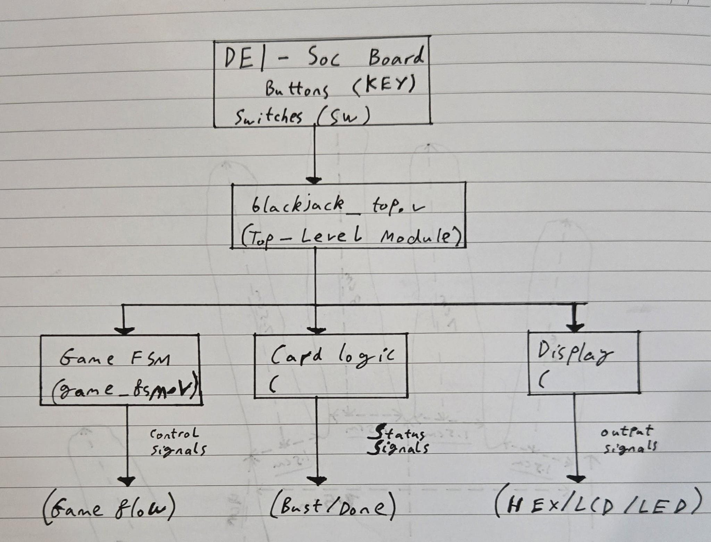
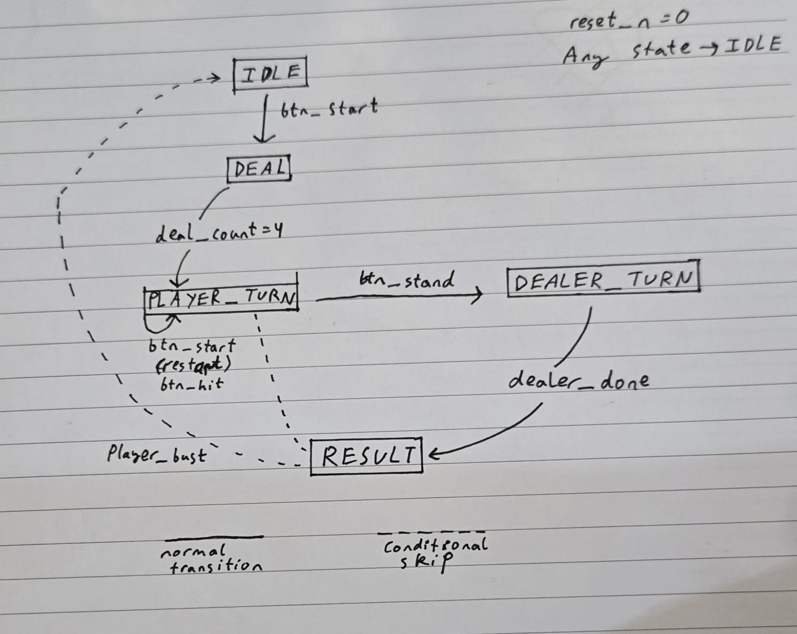
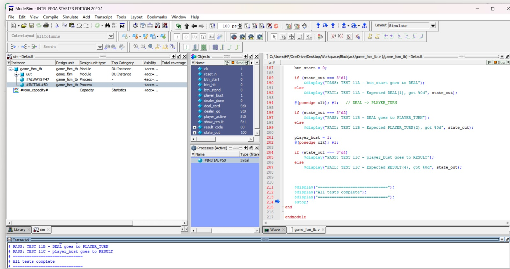
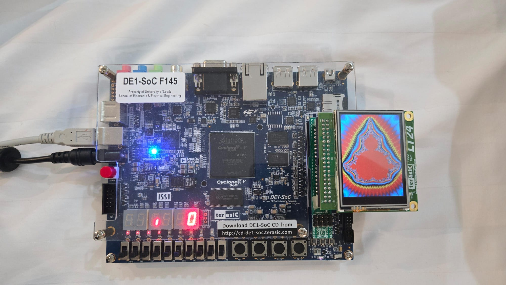
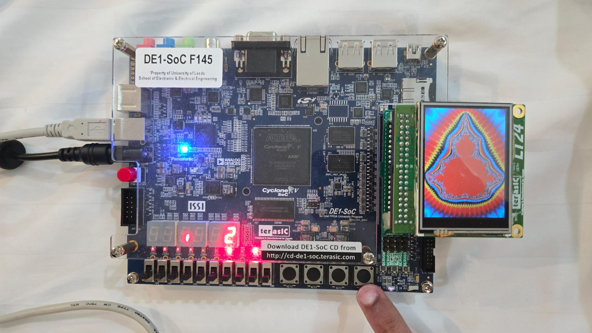
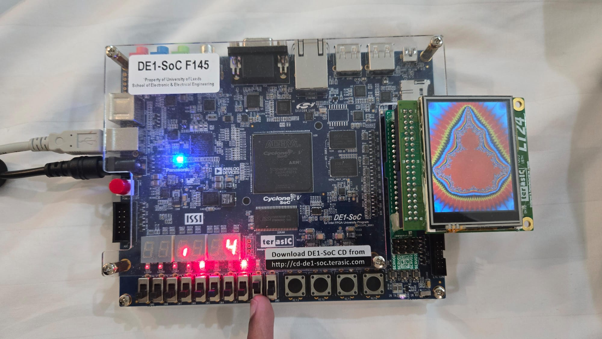

# ELEC5566M Mini-Project Repository

# ELEC5566M Mini-Project FPGA Blackjack

## Project Overview

This project aims to create a playable single-player Blackjack game on the Intel Cyclone V FPGA using the DE1-SoC board. The game is displayed using the LT24 LCD screen and controlled with the on-board push buttons. The design uses a hierarchical Verilog architecture with independent modules for game control, card generation, and the display, all of which are verified with self-checking testbenches before any hardware integration.

### Hardware Used

- DE1-SoC development board (Cyclone V 5CSEMA5F31C6 FPGA)
- LT24 LCD screen (connected via GPIO0)
- On-board push buttons (KEY[0]–KEY[3])
- On-board switches (SW[0]–SW[9])
- 7-segment displays (HEX0–HEX5)
- LEDs (LEDR[0]–LEDR[9])

### Group Members of ELEC5566M Mini-Project Group 33

1. Muhammad Ayan Tariq
2. Aditya Nautiyal
3. Bhavitha Avula

### Division of Tasks

- Game FSM and top-level integration [Muhammad Ayan Tariq]
- Card generator, scorer, dealer AI [Bhavitha Avula]
- LCD display driver and input handler [Aditya Nautiyal]
- README - FSM and integration sections [Muhammad Ayan Tariq]
- README - card logic section [Bhavitha Avula]
- README - display section [Aditya Nautiyal]

## System Design and Architecture

**Author: Muhammad Ayan Tariq**

### System Block Diagram



The system consists of three independent modules connected through the top-level integration file `blackjack_top.v`. The Game FSM acts as the central controller generating signals that sequence the card and display module. All modules share the 50MHz system clock and active-low reset signal.

### FSM State Diagram



The game is controlled by a finite state machine with five states. Outputs depend only on the current state and not on the inputs. This ensures stable, glitch-free output signals. An asynchronous active-low reset returns the FSM to IDLE from any state immediately on KEY[3] being pressed.

### Signal Definitions

| Signal           | Direction | Width | Description                              |
|------------------|-----------|-------|------------------------------------------|
| `clk`            | Input     | 1-bit | 50MHz system clock                       |
| `reset_n`        | Input     | 1-bit | Active-low async reset (KEY[3])          |
| `btn_start`      | Input     | 1-bit | Start/new game (KEY[0] inverted)         |
| `btn_hit`        | Input     | 1-bit | Player hits (KEY[1] inverted)            |
| `btn_stand `     | Input     | 1-bit | Player stands (KEY[2] inverted)          |
| `player_bust`    | Input     | 1-bit | From card module - player total > 21     |
| `dealer_done`    | Input     | 1-bit | From card module - dealer finished       |
| `deal_card`      | Output    | 1-bit | Request one card from card module        |
| `dealer_go`      | Output    | 1-bit | Start dealer AI in card module           |
| `player_active`  | Output    | 1-bit | Player turn active - sent to display     |
| `show_result`    | Output    | 1-bit | Show outcome screen - sent to display    |
| `result_code`    | Output    | 2-bit | 00=player wins, 01=dealer wins, 10=push  |
| `state_out`      | Output    | 3-bit | Current FSM state for 7-seg debug        |

### Design Decisions and Justification

An FSM was used as the game follows fixed stages (IDLE, DEAL, PLAYER, DEALER, RESULT), allowing predictable transitions based on inputs and conditions. A Moore FSM was chosen so outputs depend only on the current state, avoiding glitches. The design uses three always blocks for state, next-state, and outputs, improving readability and preventing latches. An asynchronous reset allows immediate response on button press. Active-low inputs were inverted in the top-level module to maintain consistent internal logic. Switches were used to simulate signals like player_bust and dealer_done for controlled testing before integration. A modular design separates FSM, card logic, and display, improving organisation and parallel development. State encoding uses 3 bits, enabling efficient storage and direct mapping to the 7-segment display for debugging.

## Debugging and Development Process
**Author: Muhammad Ayan Tariq**

Development involved simulation and hardware debugging. FSM behaviour was first verified in ModelSim under different conditions. A JTAG programming error was resolved by correcting device selection in Quartus. Active-low button issues were fixed by inverting signals using ~KEY. Incorrect state transitions were traced to button mapping and resolved through testing. Switches were used to simulate signals like player_bust and dealer_done for controlled testing. HEX display and LEDs were used to monitor FSM states and internal signals during debugging.

## Functional Verilog Coding
**Author: Muhammad Ayan Tariq**

### Module: game_fsm.v

This module implements the top-level game controller as a three-process Moore FSM. It sequences all game events and generates control signals for the card module and display module.

#### Port table

| Port            | Direction | Type | Width | Purpose              |
|-----------------|-----------|------|-------|----------------------|
| `clk`           | Input     | wire | 1     | System clock         |
| `reset_n`       | Input     | wire | 1     | Active-low reset     |
| `btn_start`     | Input     | wire | 1     | Start game           |
| `btn_hit`       | Input     | wire | 1     | Player hits          |
| `btn_stand`     | Input     | wire | 1     | Player stands        |
| `player_bust`   | Input     | wire | 1     | Scorer signals bust  |
| `dealer_done`   | Input     | wire | 1     | Dealer AI finished   |
| `deal_card`     | Output    | reg  | 1     | Deal one card        |
| `dealer_go`     | Output    | reg  | 1     | Start dealer AI      |
| `player_active` | Output    | reg  | 1     | Player turn active   |
| `show_result`   | Output    | reg  | 1     | Display result       |
| `result_code`   | Output    | reg  | 2     | Win/lose/push code   |
| `state_out`     | Output    | wire | 3     | Debug state output   |

#### State encoding

| State name  | Encoding | Active output  |
|-------------|----------|----------------|
| IDLE        | 3'b000   | None           |
| DEAL        | 3'b001   | deal_card      |
| PLAYER_TURN | 3'b010   | player_active  |
| DEALER_TURN | 3'b011   | dealer_go      |
| RESULT      | 3'b100   | show_result    |

#### Clocked state register
```verilog
always @(posedge clk or negedge reset_n) begin
    if (!reset_n)
        state <= IDLE;
    else
        state <= next_state;
end
```

The non-blocking assignment (`<=`) ensures all state registers update simultaneously at the clock edge, preventing race conditions. The asynchronous reset path ensures the board always starts in a known safe state regardless of clock phase.

### Module: blackjack_top.v

This module is the top-level integration layer. It declares internal wires and instantiates all three sub-modules, connecting their ports. This hierarchical approach means each module can be developed, tested, and replaced independently.

#### Integration approach

During development, `player_bust` and `dealer_done` were temporarily connected to physical switches SW[0] and SW[1]. This allowed hardware testing of every FSM state transition before the card module was complete.

## Datapath Design (Card Generator & Scoring)
**Author: Bhavitha Avula**

### Overview

The datapath module is responsible for all card-related operations in the Blackjack system. This includes generating pseudo-random card values, storing the cards for both the player and dealer, and calculating their respective scores according to Blackjack rules.

The datapath operates independently of the FSM and receives control signals such as `deal_player` and `deal_dealer`. It outputs the computed scores, which are then used by the FSM to determine game outcomes.


### Module: blackjack_datapath.v

This module integrates the card generator, hand storage, and score calculation into a single datapath system.

#### Port table

| Port            | Direction | Type | Width | Purpose                              |
|-----------------|-----------|------|-------|--------------------------------------|
| `clk`           | Input     | wire | 1     | System clock                         |
| `reset`         | Input     | wire | 1     | Active-high reset                    |
| `deal_player`   | Input     | wire | 1     | Signal to deal card to player        |
| `deal_dealer`   | Input     | wire | 1     | Signal to deal card to dealer        |
| `player_score`  | Output    | wire | 6     | Calculated player score              |
| `dealer_score`  | Output    | wire | 6     | Calculated dealer score              |


### Card Generation (lfsr_card_gen.v)

A Linear Feedback Shift Register (LFSR) is used to generate pseudo-random card values. The output is mapped to a range of 1–13 to represent standard playing cards:

- Ace = 1  
- Cards 2–10 = face value  
- Jack, Queen, King = 11–13  

This method is hardware-efficient and suitable for FPGA implementation.


### Hand Storage (hand_storage.v)

The hand storage module stores up to five cards for both the player and dealer using register arrays.

#### Key Features:
- Maintains a card count using a 3-bit counter  
- Stores each incoming card sequentially  
- Limits storage to five cards to prevent overflow  


### Score Calculation (score_calc.v)

The score calculation module computes the total value of a hand according to Blackjack rules.

#### Rules implemented:
- Number cards (2–10) → face value  
- Face cards (J, Q, K) → value 10  
- Ace → treated as 11 or 1 depending on total score  

The module adjusts Ace values dynamically to avoid unnecessary busts.


### Design Decisions and Justification

An LFSR-based approach was chosen due to its simplicity and efficiency in hardware. A modular design was adopted, separating card generation, storage, and scoring into independent components, allowing easier testing and integration.

A fixed hand size of five cards was selected to simplify implementation and reduce hardware usage.


### Known Limitations

- No deck tracking is implemented  
- A card value may appear more than four times  
- Card generation is pseudo-random, not truly random  

These simplifications were made to reduce design complexity.


### Verification and Testing

Each datapath component was tested individually:

- Card generator verified for valid range (1–13)  
- Hand storage verified for correct sequencing  
- Score calculation verified including Ace handling  

The integrated datapath compiles successfully in Quartus and is ready for full system integration.


### Summary

The datapath module provides a complete implementation of the Blackjack card engine, including card generation, storage, and scoring. It forms the core computational unit of the system and interfaces with both the FSM and display modules.
## Testbench Verification

**Author of this section: Muhammad Ayan Tariq**

### Verification strategy

Each module was verified independently using a self-checking testbench before integration. The testbench uses `$display` statements to automatically print PASS or FAIL for each test case.

### Test Cases - game_fsm_tb.v

| Test | Description                                               | Expected Output     | Result  |
|------|-----------------------------------------------------------|---------------------|---------|
| 1    | Reset initializes FSM to IDLE state                       | `state_out = 0`     | PASS    |
| 2    | `btn_start` transitions FSM from IDLE to DEAL             | `state_out = 1`     | PASS    |
| 3    | DEAL state automatically transitions to PLAYER_TURN       | `state_out = 2`     | PASS    |
| 4    | `player_active` is asserted during PLAYER_TURN            | `player_active = 1` | PASS    |
| 5A   | `btn_hit` keeps FSM in PLAYER_TURN                        | `state_out = 2`     | PASS    |
| 5    | `btn_stand` transitions FSM to DEALER_TURN                | `state_out = 3`     | PASS    |
| 6    | `dealer_go` is asserted during DEALER_TURN                | `dealer_go = 1`     | PASS    |
| 7    | `dealer_done` transitions FSM to RESULT state             | `state_out = 4`     | PASS    |
| 8    | `show_result` is asserted during RESULT state             | `show_result = 1`   | PASS    | 
| 9    | `btn_start` transitions FSM from RESULT back to IDLE      | `state_out = 0`     | PASS    | 
| 10   | `reset_n` forces FSM back to IDLE from any state          | `state_out = 0`     | PASS    |
| 11A  | `btn_start` transitions FSM from IDLE to DEAL again       | `state_out = 1`     | PASS    |
| 11B  | DEAL state automatically transitions to PLAYER_TURN again | `state_out = 2`     | PASS    |
| 11C  | `player_bust` transitions FSM directly to RESULT          | `state_out = 4`     | PASS    |

### Simulation Transcript



All 14 FSM verification checks passed successfully in ModelSim Intel FPGA Starter Edition 2020.1.

## Hardware Testing
**Author of this section: Muhammad Ayan Tariq**

### Test setup

The compiled design was programmed onto the DE1-SoC via the USB-Blaster interface using Quartus Programmer. 

### Hardware test procedure

Each FSM state was verified physically by observing HEX0 (7-segment display showing state number) and LEDR[0–5] (showing active output signals):

| Action                  | Expected HEX0       | Expected LEDs | Observed  |
|-------------------------|---------------------|---------------|-----------|
| Power on                | 0 (IDLE)            | All off       | Correct   |
| Press KEY[0]            | 2 (PLAYER_TURN)     | LEDR[3] on    | Correct   |
| Press KEY[2]            | 3 (DEALER_TURN)     | LEDR[4] on    | Correct   |
| Flip SW[1]              | 4 (RESULT)          | LEDR[5] on    | Correct   |
| Press KEY[3]            | 0 (IDLE)            | All off       | Correct   |
| Press KEY[0] then SW[0] | 4 (RESULT via bust) | LEDR[5] on    | Correct   |

### Hardware photos





## Integration Log and Bug Fixes
**Author: Muhammad Ayan Tariq**

### Overview

Integration connected independently developed modules through `blackjack_top.v`, which declares internal wires and connects module ports.

Modules connected:

| Module | Author | Purpose |
|--------|--------|--------|
| `game_fsm.v` | Muhammad Ayan Tariq | Game controller |
| `blackjack_top.v` | Muhammad Ayan Tariq | Top-level integration |
| `blackjack_datapath.v` | Bhavitha Avula | Card generation and scoring |
| `LT24Top.v` | Aditya Nautiyal | LCD display |


### Integration Decisions

**Decision 1 - Signal name mapping**

`blackjack_datapath.v` uses `deal_player` and `deal_dealer` as input names. `game_fsm.v` outputs `deal_card` and `dealer_go`. These were mapped in `blackjack_top.v` without modifying either module:

```verilog
blackjack_datapath u_datapath (
    .deal_player (deal_card),   // FSM deal_card maps to datapath deal_player
    .deal_dealer (dealer_go),   // FSM dealer_go maps to datapath deal_dealer
);
```

**Decision 2 - Score width adaptation**

blackjack_datapath.v outputs 6-bit scores [5:0]. LT24Top.v was updated to accept full 6-bit scores.

**Decision 3 - Generating missing control signals**

blackjack_datapath.v outputs only scores. player_bust and dealer_done were derived in blackjack_top.v:

assign player_bust = (player_score > 6'd21);
assign dealer_done = (dealer_score >= 6'd17) && (state_out == 3'd3);

**Decision 4 - Active-high reset adaptation**

`game_fsm.v` uses active-low reset. `blackjack_datapath.v` and `LT24Top.v` use active-high reset. Resolved by inverting KEY[3] for those modules:

```verilog
.reset (~KEY[3])   // ~ inverts: 0 becomes 1 for active-high modules
```

**Decision 5 - Winner logic**

Neither `blackjack_datapath.v` nor `LT24Top.v` calculated who won the game. This logic was added in `blackjack_top.v` by comparing final scores and assigning a `winner` register:

```verilog
always @(*) begin
    if (player_score > 6'd21)
        winner = 2'b01;                    // player bust so dealer wins
    else if (dealer_score > 6'd21)
        winner = 2'b00;                    // dealer bust so player wins
    else if (player_score > dealer_score)
        winner = 2'b00;                    // player score higher so player wins
    else if (dealer_score > player_score)
        winner = 2'b01;                    // dealer score higher so dealer wins
    else
        winner = 2'b10;                    // equal scores so push
end
```

**Decision 6 - Button edge detection**

Without edge detection, a button press at 50MHz caused multiple triggers. Edge detection was added so each press produces one clock pulse.

**Decision 7 - Individual card values passed to display**

The updated `LT24Top.v` required individual card values to draw card faces on screen. `blackjack_datapath.v` was updated to expose individual card outputs `p0`–`p4` and `d0`–`d4` which were wired through `blackjack_top.v` to the display module.

### Bug Fix Table

| Bug | File | What Was Wrong | How Fixed |
|---|---|---|---|
| 1 | `LT24Top.v` line 614 | Stray `*/` with no matching `/*` caused entire file to fail parsing in Quartus | Deleted the broken comment line |
| 2 | `blackjack.qsf` | `game_fsm_tb.v` testbench included in synthesis project - testbench commands like `$display` and `#10` cannot be synthesised into hardware | Removed testbench from project file list |
| 3 | `blackjack_top.v` | Signal name mismatch - `game_fsm.v` outputs `deal_card` but `blackjack_datapath.v` expects `deal_player` | Mapped signals correctly in port connections without touching either module |
| 4 | `blackjack_top.v` | Score width mismatch - `blackjack_datapath.v` outputs 6-bit scores, `LT24Top.v` originally expected 5-bit scores | Updated display module to accept 6-bit scores |
| 5 | `blackjack_top.v` | `player_bust` and `dealer_done` signals did not exist anywhere - `blackjack_datapath.v` only outputs raw scores | Generated both signals using combinational assign statements comparing scores |
| 6 | `blackjack_top.v` | Reset polarity mismatch - `game_fsm.v` uses active-low reset, `blackjack_datapath.v` and `LT24Top.v` use active-high reset | Inverted KEY[3] using `~KEY[3]` for modules needing active-high reset |
| 7 | `blackjack.qsf` | Multiple LT24 LCD pin assignments were wrong - several clashed with HEX display pins causing fitter errors | Obtained verified correct GPIO0 header pins from `LT24Top.v` working project |
| 8 | `blackjack.qsf` | `SW[7]` assigned to `PIN_AE8` which is a dedicated programming pin and cannot be used for general I/O | Removed all unused switch assignments from the project |
| 9 | `blackjack_top.v` and `blackjack.qsf` | `LEDR[8]` and `LEDR[9]` assigned to pins that do not exist on the 5CSEMA5F31C6 chip variant | Reduced LEDR bus from 10 bits to 8 bits in both files |
| 10 | `blackjack.qsf` | All source files missing from Quartus project - files were being found by accident rather than proper registration | Re-added all `.v` files through Project settings |
| 11 | `game_fsm.v` | DEAL state was missing from the output logic always block - `deal_card` never went HIGH at game start so no initial cards were dealt | Added missing DEAL case to output logic |
| 12 | `game_fsm.v` | No button edge detection - holding a button for 0.2 seconds at 50MHz registered 10 million clock ticks causing multiple cards to be dealt per press giving impossible scores | Added edge detection registers for all three buttons - each press now fires for exactly one clock tick |
| 13 | `LT24Top.v` | Result colour logic placed outside the `else begin` block - green background `16'h0340` was overwriting the result colour every pixel | Restructured the pixel drawing block so result colour check is the first condition and all normal drawing is inside the `else begin` |
| 14 | `LT24Top.v` | `show_result`, `player_active` and `result_code` ports were missing from `LT24Top.v` module declaration - compilation failed with port not found errors | Added three input ports to the module declaration and connected them from `blackjack_top.v` |

### Hardware Testing Results

Initially, button presses caused multiple card deals due to high clock frequency. This was fixed using edge detection in `game_fsm.v`.

| Test | Action | Expected | Observed | Result |
|---|---|---|---|---|
| 1 | KEY[3] reset - power on | LCD shows casino screen, HEX displays show 0, FSM in IDLE | LCD showing WELCOME TO THE CASINO and BLACK JACK in red, HEX showing 0 | PASS |
| 2 | KEY[0] - start game | FSM moves to PLAYER_TURN, state 2 shown on HEX | HEX changed to show 2, LEDs updated confirming state change | PASS |
| 3 | KEY[1] - player hits | Player score increases by one card value, maximum 11 per card | Score updated correctly after edge detection fix | PASS |
| 4 | KEY[2] - player stands | Dealer plays automatically, dealer score appears | Dealer score correctly shown on left displays | PASS |
| 5 | Player busts - score over 21 | LCD turns red, dealer wins | LCD turned red correctly | PASS |
| 6 | Player wins - higher score than dealer | LCD turns green, player wins | LCD turned green correctly | PASS |
| 7 | Draw - equal scores | LCD turns yellow, push | LCD turned yellow correctly | PASS |
| 8 | KEY[3] - reset from any state | All scores back to 0, FSM returns to IDLE | HEX showing 0, LCD showing casino screen | PASS |

### Hardware Testing Notes

Button edge detection was not implemented in the initial design. Without it, a single button press at 50MHz was registering millions of times causing multiple cards to be dealt per press and impossible scores. This was resolved by adding edge detection registers to `game_fsm.v` (Bug 12 above).

### Result Display Logic

The game result is encoded as:

- `2'b01` → Player Win
- `2'b00` → Player Loss
- `2'b10` → Draw (Push)

During integration, the display module initially did not handle the draw condition, resulting in no visual output for tied scores. This was resolved by adding a dedicated rendering block in `LT24Top.v` to display "TIE" when `result_code == 2'b10`. Additionally, a syntax issue caused by missing `begin/end` in the pixel generator always block was fixed.


## Future Improvements

- Add betting system and player balance
- Improve card graphics with suit symbols
- Add sound effects using audio CODEC
- Implement animations for card dealing
- Support multiple players
- Add difficulty modes for dealer AI

# Binary to 7-Segment Display Decoder (Verilog)

**Author: Aditya Nautiyal**

## Overview
This section consitst of using  A 7-segment display for showing the calculated score and LT24 display for showing the Cards

---

## 7-segment display

### 1. Bin_to_Dec
Converts a 5-bit binary number into:
- `tens` digit (0–3)
- `units` digit (0–9)

#### Inputs
- `sum[4:0]` → Binary input (0 to 31)

#### Outputs
- `digit_1[6:0]` → Tens place (left 7-segment display)
- `digit_0[6:0]` → Units place (right 7-segment display)

---

### 2. SevenSegDecoder
Converts a 4-bit decimal digit into a **7-segment display pattern** (active-low).

#### Inputs
- `n[3:0]` → Decimal digit (0–9)

#### Outputs
- `hex[6:0]` → Segment control signals `{g, f, e, d, c, b, a}`
| Segment | Meaning      |
| ------- | ------------ |
| a       | top          |
| b       | top-right    |
| c       | bottom-right |
| d       | bottom       |
| e       | bottom-left  |
| f       | top-left     |
| g       | middle       |

---

##  How It Works

1. The input binary number (`sum`) is compared in ranges:
   - 0–9 → directly displayed
   - 10–19 → subtract 10, set tens = 1
   - 20–29 → subtract 20, set tens = 2
   - 30–31 → subtract 30, set tens = 3

2. The resulting digits are sent to the `SevenSegDecoder`.

3. Each decoder converts the digit into a 7-segment pattern.


## #  LT24 LCD 


It is a fully graphics engine that renders:
- Dealer and Player cards
- Card values (1–13)
- Casino UI text (WELCOME, BLACK JACK, DEALER, PLAYER)
- Game results (WIN / LOSS / DRAW)
- Scores using 7-segment displays


##  Display Specs
- Resolution: **240 × 320 pixels**
- Color format: **16-bit RGB (RGB565)**
- Interface: Parallel LT24 controller

## Pixel Rendering Method

Each pixel is generated using:

- `xCount` → horizontal pixel (0–239)
- `yCount` → vertical pixel (0–319)

Each clock cycle:
Scan pixel coordinate ->Evaluate display logic->Assign `pixelData`->Send to LCD

Default table color:
pixelData <= 16'h0340; // Green casino table

## Each card has 3 layers:

1. **Fill (White)**

pixelData <= WHITE;
Dealer cards yCount: 85 → 171  Player area: yCount: 210 → 297
xCount >= (10 + i*45) && xCount <= (40 + i*45)

Card Positioning
Cards are placed horizontally:
x = 10 + i * 45
Where:
i = 0 to 4
Max 5 cards per hand
A pixel belongs to a card if:

2. **Border (Black)**
if (edge condition) pixelData <= BLACK;


3. **Value (Red number)**
pixel_on = 1 → pixelData <= RED;
 
 Local Coordinate Conversion

Inside each card:

x = xCount - card_start_x;
y = yCount - card_start_y;

This creates a local drawing space per card.

 
Card Number Rendering (1–13)
Method

Each card value is rendered using a manual bitmap logic engine.

Example:

4'd2: if (y == 4 || y == 11 || y == 18 || ...)

### Text Rendering System
All text is drawn using coordinate-based bitmap logic.

Each letter is defined by:

if (xCount >= A && xCount <= B && yCount >= C && yCount <= D)

| Text Label            | Y-Range (Pixels) | Color |
| --------------------- | ---------------- | ----- | 
| WELCOME TO THE CASINO | 10 – 20          | White | 
| BLACK JACK            | 35 – 47          | Red   | 
| DEALER                | 70 – 78          | Black | 
| PLAYER                | 193 – 201        | Black | 


### Pixel-by-Pixel Rendering (No Framebuffer)
Decision:

The display is generated using real-time evaluation of (xCount, yCount) rather than storing image data in memory.

**Justification**
Reduces hardware complexity
Ensures deterministic rendering per pixel clock
**Trade-off**
High combinational logic usage
No easy animation support
Repeated recalculation each frame

## Conclusion

The Blackjack FPGA system was successfully designed, implemented, and tested on hardware. The modular Verilog architecture allowed independent development and efficient integration of the FSM, datapath, and display modules. All functional requirements were achieved, including real-time gameplay, automatic dealer logic, and graphical LCD output. The system was fully verified through simulation and hardware testing, with all test cases passing. Key challenges included signal integration, reset polarity mismatches, and display rendering issues, all of which were resolved through systematic debugging. The final system demonstrates strong understanding of digital design, FSM implementation, hardware interfacing, and FPGA development workflows.