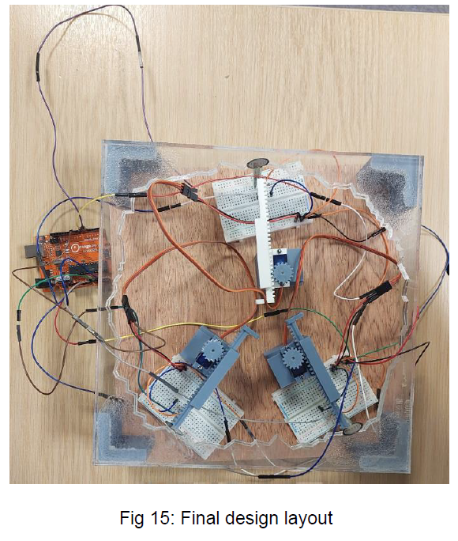
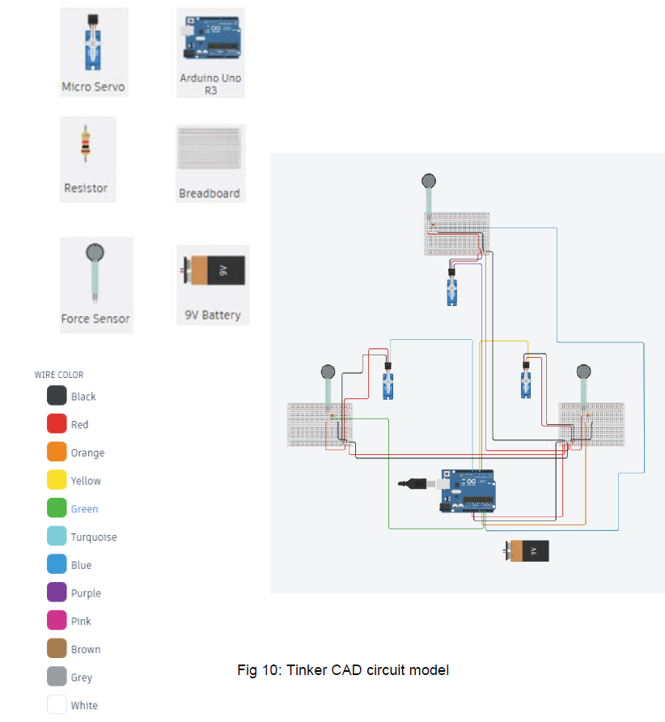
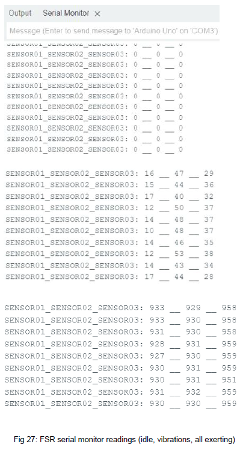
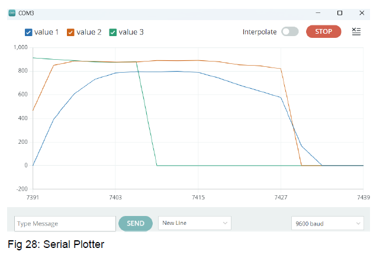

# Low-Cost Intelligent Control System for Slipform Tunnelling Machines

BEng Individual Project (ES327), University of Warwick.

Design, build and validation of a low-cost, force-adaptive control system
for a Slipform Tunnelling Machine (STM), using force-sensing resistors and
rule-based logic to align three actuators against an irregular tunnel
boundary and halt each one on contact to prevent overload.

---

## Overview

A benchtop demonstrator standing in for the alignment control of a full-size
STM. Three servo-driven "actuators" extend outward against a tunnel-shaped
boundary; each carries a force-sensing resistor and stops the instant its
contact force crosses a set threshold.

| | Specification |
|---|---|
| Actuators | 3 × micro servo, each driving a 3D-printed rack and pinion |
| Linear travel | 50 mm per pinion revolution (16-tooth pinion, 29-tooth rack) |
| Sensing | 3 × force-sensing resistor (FSR), circular variant |
| Signal conditioning | Voltage divider per FSR, 3.3 kΩ series resistor |
| Controller | Arduino Uno |
| Boundary | Laser-cut irregular "tunnel" profile, 277 mm max diameter |
| Budget | £200 (met — mechanism 3D-printed in-house) |

Rotational motion from each micro servo is converted to linear motion by a
rack and pinion, selected over linear actuators, lead screws and a scotch
yoke on cost, simplicity and flexibility. The rule is deliberately simple:
`IF force > threshold, STOP actuator`.

---

## Engineering work

- Comparative selection of the motion mechanism (linear actuator vs. rack
  and pinion vs. lead screw vs. scotch yoke) against cost and flexibility
- CAD design of the servo holders, rack-and-pinion assemblies and boundary
  in Fusion 360
- 3D printing and laser cutting of all mechanical parts
- Voltage-divider circuit design for FSR readout on the Arduino ADC
- Rule-based control firmware in C, halting each actuator on force threshold
- Serial-monitor and serial-plotter validation of the force response
- Design of an irregular boundary to test alignment across many geometries

---

## System architecture

The system operates as follows:

- three actuator–FSR pairs arranged around an irregular boundary
- each actuator extends until its FSR reads above a preset force threshold
- on threshold, the Arduino halts that actuator to prevent overload
- the actuator nearest the boundary contacts and stops first, then the
  others, until all three hold three-point contact
- power is funnelled through a main breadboard to the others, since the
  Arduino alone has insufficient power and ground pins

---

## Experimental results

FSR outputs were read in Arduino analog units on the serial monitor: near
zero at idle, small readings from servo start-up vibration, and a clear
spike on contact that triggers the halt.

| Behaviour | Outcome |
|---|---|
| Actuators halt on reaching FSR threshold | Demonstrated |
| Three-point synchronised contact on the irregular boundary | Demonstrated |
| Alignment held across varied boundary orientations | Demonstrated |

The core principle — actuators working in harmony under force feedback to
hold alignment against an irregular boundary — was validated. Serial-plotter
traces of the FSR values are in `results/`.

---

## Limitations

This is a proof-of-concept demonstrator and was not tested on a real
tunnelling machine.

- The rack occasionally slips against the pinion when the servo overdrives
  it, causing intermittent stalling — a mechanical incompatibility, not a
  control failure.
- Servo start-up vibration is read by the FSRs as low-level noise; a fixed
  threshold was used instead of a noise filter.
- The planned inner sync ring was not built, so the actuators were not
  confirmed to stay in sync under a master–slave arrangement.
- The rule base is fixed; adaptive force limits (e.g. fuzzy logic) were left
  to future work.

---

## Repository structure

| Folder | Contents |
|---|---|
| `firmware/` | Arduino rule-based control code |
| `cad/` | Fusion 360 parts and STEP exports (servo holder, rack, pinion, boundary) |
| `results/` | Serial-monitor logs and serial-plotter traces |
| `images/` | Prototype photographs and circuit diagrams |
| `docs/` | Two-page project summary |

---

## Author

**Muhammad Ayan Tariq**
BEng (Hons) Mechanical Engineering, University of Warwick